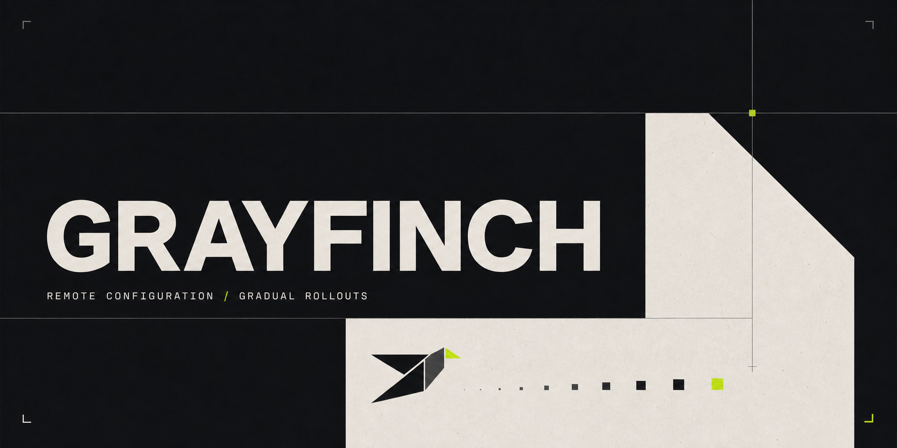
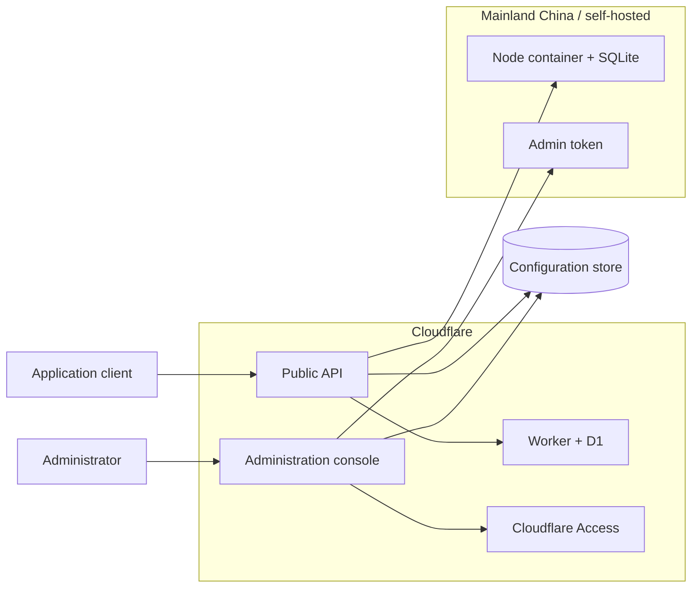

# Grayfinch



[](https://github.com/canaanyjn/Grayfinch/actions/workflows/ci.yml)
[](LICENSE)
[](https://workers.cloudflare.com/)

Grayfinch is a lightweight remote configuration and gradual rollout console.
It can run on Cloudflare Workers with D1, or as a self-hosted container in
mainland China (including Alibaba Cloud, Tencent Cloud, Huawei Cloud, and any
other platform that provides a container runtime and persistent volume).
Both deployment paths expose the same administration and client APIs.

> Let every configuration change fly with a small flock first.

## Features

- Applications with independently rotatable client tokens
- Immutable configuration versions for production, staging, and development
- Stable and canary version selection with deterministic client bucketing
- Rollout targeting by platform, minimum app version, and explicit allowlist
- Fast rollback by switching the stable version
- Audit records for application, version, release, and token changes
- Cloudflare Access JWT validation for all administration endpoints
- `ETag` and `If-None-Match` support for efficient client polling
- Separate public and administration Workers without requiring a custom domain
- Domestic container deployment with built-in SQLite and token-protected admin

## Architecture



The public surface only serves `/api/v1/config/*`; the administration surface
serves the console and `/api/admin/*`. On Cloudflare, two Workers share one D1
database. In the domestic container path, two container instances share one
SQLite persistent volume.

The split is intentional: Cloudflare Access protects every route on a Worker
when the Worker itself is selected as the application destination. Separating
the deployments keeps the client configuration endpoint public while the
management surface remains protected.

## Technology

- React 19 and TypeScript
- Hono
- Vite and the Cloudflare Vite plugin
- Cloudflare Workers, D1, and Access (Cloudflare deployment)
- Node.js 22 built-in SQLite (domestic container deployment)
- Vitest

## Requirements

- Node.js 22 or newer
- npm 10 or newer
- Either a Cloudflare account and Wrangler, or a container platform with a
  persistent volume

## Local development

Clone the repository and install dependencies:

```bash
git clone https://github.com/canaanyjn/Grayfinch.git
cd Grayfinch
npm install
```

Create local configuration files:

```bash
cp .dev.vars.example .dev.vars
cp wrangler.example.jsonc wrangler.jsonc
cp wrangler.public.example.jsonc wrangler.public.jsonc
```

Prepare the local database and start the development server:

```bash
npm run db:migrate:local
npm run db:seed:local
npm run dev
```

The seed data uses:

- Application key: `desktop-suite`
- Client token: `demo-client-token`
- Local administration authentication bypass:
  `LOCAL_DEV_AUTH_BYPASS=true`

The bypass is intended for local development only. Never enable it in a
production deployment.

## Client API

Request the active configuration with an application token:

```bash
curl "http://localhost:5173/api/v1/config/desktop-suite?environment=production&client_id=device-001&platform=macos&app_version=2.3.1" \
  -H "Authorization: Bearer demo-client-token"
```

Example response:

```json
{
  "app": "desktop-suite",
  "environment": "production",
  "version": 13,
  "variant": "canary",
  "matchedBy": "percentage",
  "config": {
    "featureFlags": {
      "newSidebar": true
    }
  }
}
```

Clients should persist the response `ETag` and send it with
`If-None-Match` on subsequent requests. Grayfinch returns `304 Not Modified`
when the selected configuration has not changed.

Treat client tokens as secrets. Do not embed privileged administration
credentials in client applications.

## Production deployment

### Mainland China / self-hosted container

The domestic path is provider-neutral: it runs on a single Node 22 container
with a persistent SQLite volume, so it can be deployed to Alibaba Cloud ECS,
Tencent Cloud Lighthouse/CVM, Huawei Cloud ECS, or a managed container product
that can mount durable storage. The two surfaces must be deployed separately;
do not expose the administration container publicly without an HTTPS reverse
proxy and a strong `ADMIN_API_TOKEN`.

For a local smoke deployment, create an ignored `.env` file with a long random
token, then start both services:

```bash
openssl rand -hex 32
# Put the value in .env as ADMIN_API_TOKEN=...
docker compose -f docker-compose.domestic.yml up --build
```

- Administration console: `http://localhost:8787`
- Public client API: `http://localhost:8788`

The administration container applies every SQL file in `migrations/` to the
named volume before the public API starts.
The console asks for the administration token once and keeps it only in the
browser session. The public API continues to require each application's client
token.

For a single-process development run instead of Docker:

```bash
npm run build:domestic
ADMIN_API_TOKEN="replace-with-a-long-random-value" \
DEPLOYMENT_ROLE=admin npm run start:domestic
```

Run a second process with `DEPLOYMENT_ROLE=public`, a distinct `PORT`, and the
same `DATABASE_PATH` only when both processes are on the same host. For
multi-node domestic production, use one instance with a durable volume today;
SQLite volumes must not be shared over network filesystems. A PostgreSQL
adapter is the appropriate next step before horizontal scaling.

Cloudflare and domestic deployments deliberately use independent stores. This
keeps credentials and latency local; if the same configuration must be active
in both regions, use one deployment as the source of truth and add an explicit
replication workflow rather than attempting to share a SQLite or D1 file.

### Cloudflare

### 1. Create D1

Authenticate Wrangler and create a database:

```bash
wrangler login
wrangler d1 create grayfinch
```

Copy the example configuration files if you have not already done so:

```bash
cp wrangler.example.jsonc wrangler.jsonc
cp wrangler.public.example.jsonc wrangler.public.jsonc
```

Set the returned `database_id` in both local Wrangler configuration files,
then apply migrations:

```bash
npm run db:migrate:remote
```

Do not run `seed.sql` against production.

### 2. Configure Cloudflare Access

1. Enable an identity provider such as One-time PIN in Cloudflare Zero Trust.
2. Create a self-hosted Access application.
3. Select **Workers** as the destination and the administration Worker as its
   scope.
4. Create an **Allow** policy for specific administrators. Avoid `Everyone`.
5. Copy the Access Team Domain and application Audience (`AUD`) into
   `wrangler.jsonc`.

```json
{
  "vars": {
    "DEPLOYMENT_ROLE": "admin",
    "ACCESS_TEAM_DOMAIN": "your-team.cloudflareaccess.com",
    "ACCESS_AUD": "your-access-application-audience"
  }
}
```

Grayfinch validates the Access JWT again inside `/api/admin/*`, providing a
second enforcement layer behind the Access application.

### 3. Deploy

```bash
npm run deploy
```

This deploys:

- `grayfinch-admin.<subdomain>.workers.dev` for the protected console
- `grayfinch.<subdomain>.workers.dev` for client configuration requests

Worker names can be changed in the local Wrangler files.

## Rollout behavior

1. Clients on the explicit allowlist always receive the canary version.
2. Other clients must match the configured platform and minimum app version.
3. Matching clients are assigned with
   `hash(app_key + client_id + rollout_salt) % 10000`.
4. Increasing the percentage does not change `rollout_salt`, so existing
   assignments remain stable.

Platform and application version values are targeting inputs, not security
credentials. Clients can report arbitrary values.

## Available scripts

| Command | Purpose |
| --- | --- |
| `npm run dev` | Start the local Vite and Worker development server |
| `npm run build` | Build the Worker and administration interface |
| `npm run build:domestic` | Build the self-hosted container interface |
| `npm run start:domestic` | Start one domestic `admin` or `public` process |
| `npm test` | Run the test suite |
| `npm run typecheck` | Run TypeScript validation |
| `npm run check` | Run type checking and tests |
| `npm run ci` | Run all CI checks, including the production build |
| `npm run db:migrate:local` | Apply D1 migrations locally |
| `npm run db:seed:local` | Load local demonstration data |
| `npm run db:migrate:remote` | Apply D1 migrations to production |
| `npm run deploy` | Build and deploy both Workers |

## Project structure

```text
.
├── migrations/          D1 schema migrations
├── skills/              Reusable agent workflows for deployment and integration
├── src/                 React administration interface
├── tests/               Unit tests
├── worker/              Hono API and rollout evaluator
├── seed.sql             Local demonstration data
├── wrangler.example.jsonc
└── wrangler.public.example.jsonc
```

## Agent Skills

This repository includes two reusable agent skills:

- [`deploy-grayfinch-cloudflare`](skills/deploy-grayfinch-cloudflare/SKILL.md)
  deploys and verifies Grayfinch on Workers, D1, and Cloudflare Access.
- [`integrate-grayfinch`](skills/integrate-grayfinch/SKILL.md) adds a resilient
  Grayfinch client to an existing product.

Install them with the open-source [`skills`](https://skills.sh/) CLI:

```bash
npx skills add canaanyjn/Grayfinch
```

Invoke them as `$deploy-grayfinch-cloudflare` and `$integrate-grayfinch`.

## Contributing

Contributions are welcome. Read [CONTRIBUTING.md](CONTRIBUTING.md) before
opening a pull request. Please report security issues according to
[SECURITY.md](SECURITY.md), not through a public issue.

## License

Grayfinch is available under the [MIT License](LICENSE).
